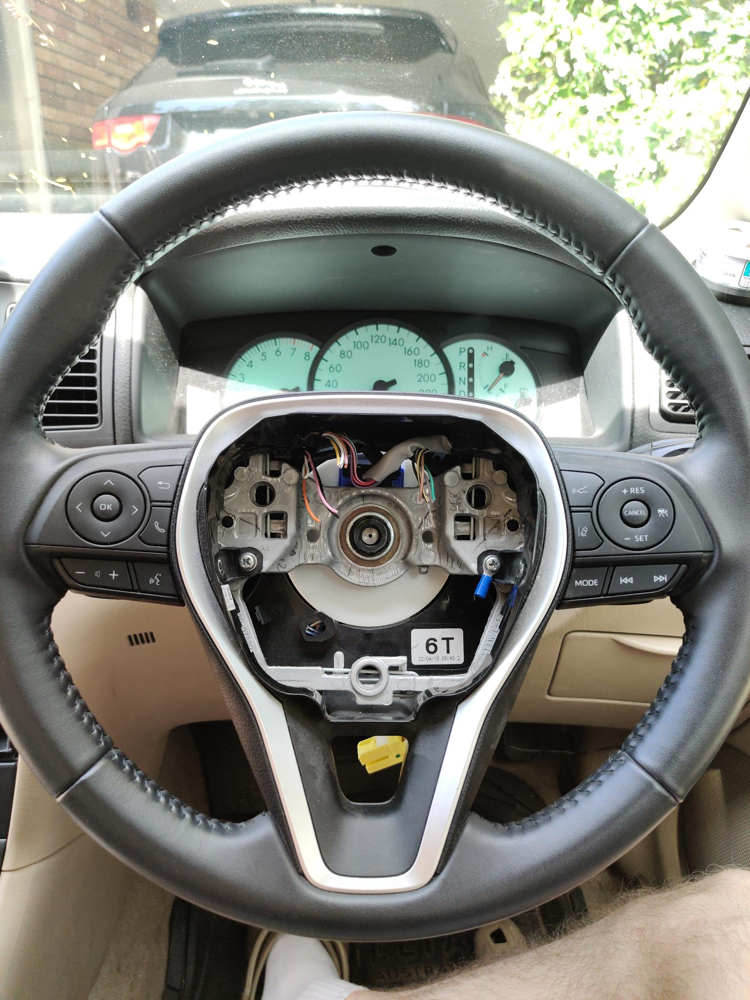

  <h1>Toyota Steering Wheel</h1>
  
Toyota (20-24) EV Steering Wheel Transceiver, Clockspring and Spline Adapter.

  
Personal project for extending compatibility with my 2003 Toyota Corolla, including extended functionality for the buttons, paddles and horn

### Photos

#### Car PCB v1.0
- Molex connector for hard-wired button outputs, horn relay and interior light input
- AUX cable socket for communication with head unit (remote buttons)
- Crimp compatible power terminals

#### Car PCB v1.1
- Added digital potentiometer to replace PWM based solution for setting AUX resistance values (didn't work)

#### Steering Wheel PCB v1.0
- IDC connector hard-wired to existing connector wires, includes 12V power in, horn switch and GND

#### Steering Wheel PCB v1.1
- Fixed resistor ladder design (mode and CC minus buttons being same value)
- Relocated microcontroller for better USB-C accessibility

#### Clockspring Front

#### Clockspring Back

#### Spline Adapter and washer

#### Clockspring and spline adapter test fitting
- Successful fitment with SLA printed steel spline adapter and FDM printed clockspring (prototype)

### Material List

**Crimps**

- FDD1.25-250 (Horn Tab)
- RV1.25-4 (Ground)
- MDD1.25-187 and FDD1.25-187 (Power Connection)

**Screws**

- M5x12mm Flat Head Nut & Bolt

**Splicing**

- 2.5 - 3mm Diameter Heat Shrink
- Solder, and Soldering Iron
- Wire Strippers and/or Wire Cutters

**Connectors**

- 24 pin ATX cable (24-pin Molex Mini-Fit Jr.™)
- 16 pin IDC cable
- Also for the PCBs:
  - Sparkfun ATX Power Supply Connector - Right Angle (`PRT-09498`)
  - Two 7x1 Pin Headers (Female and Male) or just cut to size

**Airbag Connector**

- Typically the airbag inflator on the new steering wheel will use 1 or 2 connectors based on the 3 variations of the **AK2 Squib Connector**.
  - In my case, the Toyota EV steering wheel airbag inflator used a single **Code 2 (Blue/Green) AK2 Squib Connector**.
  - You can find each individual connector here: [Link to Molex PDF](https://www.content.molex.com/dxdam/literature/987650-4993.pdf)
- You can source these connectors either by:
  - Buying the same clockspring used with the new steering wheel (Toyota)
  - Buying a third party clockspring from older cars that happen to use the same connector (Kia, Hyundai, GM in some cases).

**Microcontrollers**

- **Xiao ESP32-C3** - Mounted inside the steering wheel
- **Xiao ESP32-S3** - Mounted in the car, below the clockspring

**Custom PCBs**

- Ordered on JLCPCB
- Please take a look in the [hardware](/hardware) directory:
  - Steering Wheel Transciever
  - Car Transciever

**Spline Adapter**

- Required to fit the steering wheel on older cars (tested working with 2003 Toyota Corolla).
- Ordered on IN3DTEC (Maraging Steel, Bead blasted)

**Clockspring**

- Provides wiring for the airbag and repurposed horn cable (12V Power)
- Printed locally using Bambu P1S (White ABS, 0.2mm nozzle)
- You must also purchase the clockspring used with the old steering wheel, as the new clockspring will reuse the spiral ribbon cable and connectors.
